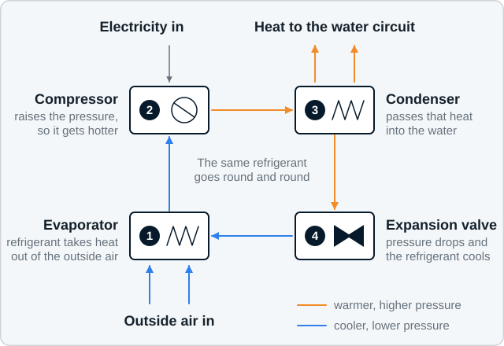

# assets — the drawings and icons

Every illustration on the Airwarm website lives in this folder. All of it is
hand-written SVG: plain text files you can open in any editor, with no build
step, no library and nothing loaded from another website.

There is **no photography here, and no photography anywhere on the site yet**.
See "What still needs real photography" at the end of this file.

- [A note on paths](#a-note-on-paths)
- [What is in here](#what-is-in-here)
- [How to change a label in a drawing](#how-to-change-a-label-in-a-drawing)
- [How to put a drawing on a page](#how-to-put-a-drawing-on-a-page)
- [The icon sprite](#the-icon-sprite)
- [The CSS classes](#the-css-classes)
- [Colour and contrast rules](#colour-and-contrast-rules)
- [What still needs real photography](#what-still-needs-real-photography)
- [What was deliberately not drawn](#what-was-deliberately-not-drawn)

---

## A note on paths

**Every reference to this folder is relative, never starting with a slash.**
The site is served from a sub-folder on GitHub Pages rather than from the root
of a domain, so a path beginning with `/` resolves to the wrong place and
404s. There are two cases:

- **In a page**, `src` and `href` resolve against the page, so the number of
  dots depends on how deep the page is. From `/index.html` it is
  `assets/icons.svg`; from `/how-it-works/index.html` it is
  `../assets/icons.svg`; from `/areas/leeds/index.html` it is
  `../../assets/icons.svg`. The examples below use one `../`, which is right
  for the ordinary one-folder-deep page. Count the folders and match.
- **In `css/airwarm.css`**, a `url()` resolves against the *stylesheet*, not
  the page, so it is always `../assets/…` no matter which page is being
  viewed. There is only one such URL, in `.aw-hero-pattern`.

---

## What is in here

| File | What it shows |
|---|---|
| `diagram-how-it-works.svg` | The refrigeration cycle: outside air into the evaporator, then compressor, condenser, expansion valve, and heat out to the water circuit. The flagship diagram. |
| `diagram-system-layout.svg` | A whole system in cutaway: outdoor unit, pipes through the wall, cylinder, buffer or volumiser, emitters, controls. Numbered, with a key. |
| `diagram-heat-loss.svg` | Where heat escapes a house: roof, walls, windows, floor, draughts. Arrow widths only — **no percentages, and none may be added**. |
| `diagram-flow-temperature.svg` | The same room and the same heat demand, with a small radiator at a higher flow temperature and a bigger one at a lower flow temperature. |
| `diagram-weather-compensation.svg` | A compensation curve against a flat fixed-temperature line. Axes named, **no numeric scale**. |
| `diagram-emitter-comparison.svg` | Single panel, double panel, fan assisted and underfloor compared by proportion: a bar for relative output, four markers for how well each suits a lower flow temperature. **No output figures.** |
| `diagram-cylinder-siting.svg` | The space a hot water cylinder needs around it, and the three places it usually goes: airing cupboard, loft, utility room. |
| `diagram-outdoor-unit-siting.svg` | Plan view of the clear space around an outdoor unit — front, sides, rear, and above in a small side view — plus the condensate route and the distance to a neighbour's window. **No dimensions: every clearance is the manufacturer's minimum for the unit specified.** |
| `diagram-process.svg` | The eight steps from assessment to servicing, four across and two down. |
| `diagram-assessment-outcomes.svg` | The three assessment outcomes as a calm three-state graphic. Green for the positive one only; blue and mid grey for the others; **no red anywhere**. |
| `icons.svg` | One sprite holding the twenty line icons. See [The icon sprite](#the-icon-sprite). |
| `hero-pattern.svg` | A very quiet repeating pattern for navy hero panels. Decoration only. |
| `favicon.svg` | **A placeholder.** A plain letter A in white on navy. It is not the Airwarm emblem and must be replaced — see the note at the top of the file. |

Every diagram is built the same way, on purpose:

- a `viewBox` and no fixed width or height, so CSS decides how big it is;
- `role="img"` with a `<title>` and a `<desc>`, wired up with `aria-labelledby`,
  so a screen reader reads a proper description rather than a filename;
- **its own pale background panel**, so it is legible on a white section, a
  pale grey section or a navy one. Nothing assumes a white page;
- **a dark-theme version of itself.** If the reader's browser is set to a dark
  theme, the panel turns navy and the ink turns white automatically;
- **a narrow-screen version of itself.** Below about 520px the small
  explanatory lines are hidden and the remaining labels are set larger, so the
  drawing still reads on a phone. The page copy carries the detail, and the
  `<desc>` carries all of it for a screen reader;
- one line weight (2px structure, 1.5px detail) and one set of type sizes
  across the whole set, so the drawings look like one family;
- no gradients, no drop shadows, no photographs, no clip art.

---

## How to change a label in a drawing

You do not need to know SVG. Every word a visitor reads sits between
`<text ...>` and `</text>`:

```xml
<text class="d-label" x="215" y="414" text-anchor="middle">Outside air in</text>
```

1. Open the `.svg` file in any text editor.
2. Search for the words you want to change.
3. Type over them, **between the `>` and the `</text>`**. Leave everything else
   alone.
4. Save, and open the file in a browser to look at it.

Three things worth knowing:

- **Keep labels short.** They are set larger on a phone, and a long label can
  run off the edge of the drawing. As a rule of thumb, a label of more than
  about twenty characters needs splitting over two `<text>` lines.
- **Change the description too.** Near the top of each file there is a `<desc>`
  which is what a blind reader hears. If you change a label, change that
  sentence to match, or the drawing and the description disagree.
- **Some labels appear twice**, once for wide screens and once for narrow, with
  `d-wide-only` and `d-narrow-only` in the class. If a label has a twin, change
  both. The comment beside it says so.

Each file also has a comment block at the top explaining what it is for and
which captions must not be removed. The captions that say things like "arrow
sizes are illustrative" or "clearances are the manufacturer's minimum" are
there for a reason: they are why the drawing is allowed to carry no figures.
Please leave them in.

---

## How to put a drawing on a page

Always in a `<figure>`, always with a caption:

```html
<figure class="aw-figure">
  
  <figcaption class="aw-figure__caption">
    How a heat pump moves heat from outside air into your heating system.
  </figcaption>
</figure>
```

- `alt` should say what the drawing shows, in one sentence. It does not need to
  repeat the caption.
- The wide drawings can have `class="aw-diagram aw-diagram--wide"` if they need
  more room on a big screen.
- Do not set a width or a height on the ``. The CSS handles it, and the
  drawing can then never make the page scroll sideways.

---

## The icon sprite

`icons.svg` holds twenty symbols, all drawn on a 24 by 24 grid with a 1.5px
stroke, rounded ends and no fills. To use one:

```html
<svg class="aw-icon" aria-hidden="true" focusable="false">
  <use href="../assets/icons.svg#icon-radiator"></use>
</svg>
```

The icon is one em square and takes the colour of the text around it. Use
`class="aw-icon aw-icon--lg"` for the larger size, at the top of a card.

**Accessibility.** Keep `aria-hidden="true"` whenever the icon sits beside a
word that says the same thing, which is nearly always: otherwise a screen
reader announces the same thing twice. If an icon is genuinely on its own with
no label next to it, drop `aria-hidden` and give the `<svg>` `role="img"` and
an `aria-label` instead.

**If external references ever give trouble** (an old browser, or a page opened
straight off disk rather than served), paste the whole of `icons.svg` into the
page immediately after `<body>`, inside a wrapper with `style="display:none"`.
The same `<use href="#icon-radiator">` then finds it locally.

### The twenty IDs

| ID | What it is | Typical use |
|---|---|---|
| `icon-home` | A house | Home, property, "your home" |
| `icon-survey` | Clipboard with a magnifier | The home survey |
| `icon-design` | A set square | Design and proposal |
| `icon-install` | A spanner | Installation |
| `icon-commission` | A gauge with a needle | Commissioning and setting up |
| `icon-service` | A cycle of arrows | Annual servicing |
| `icon-radiator` | A panel radiator | Emitters, radiators |
| `icon-cylinder` | A hot water cylinder | Hot water |
| `icon-outdoor-unit` | Boxed unit with a fan | The outdoor unit |
| `icon-controls` | A wall thermostat | Controls, weather compensation |
| `icon-solar` | A solar panel | Solar PV |
| `icon-battery` | A battery | Battery storage |
| `icon-check` | A tick | Yes, included, positive outcome |
| `icon-question` | A question mark in a circle | Something to check |
| `icon-warning` | A triangle | Worth knowing, be aware |
| `icon-email` | An envelope | E-mail us |
| `icon-location` | A map pin | Service areas |
| `icon-clock` | A clock face | Timescales, response times |
| `icon-document` | A page | Proposal, guide, document |
| `icon-arrow-right` | An arrow | Next, continue, read more |

`icon-warning` is a triangle, not a red sign. It means "worth knowing", and it
takes the orange accent, never red. There is no red on this website.

---

## The CSS classes

All of these live in `css/airwarm.css`, section 11, except where noted. One
line each, with the shortest useful example.

### Figures and drawings

| Class | What it does | Example |
|---|---|---|
| `.aw-figure` | Wraps a drawing and its caption; centred, with space above and below | `<figure class="aw-figure"> … </figure>` |
| `.aw-figure__caption` | The caption: smaller, mid grey, centred, light on navy panels | `<figcaption class="aw-figure__caption">What it shows.</figcaption>` |
| `.aw-diagram` | Makes an SVG fill its column and never overflow: `width:100%`, `height:auto`, capped at 760px | `` |
| `.aw-diagram--wide` | Same, capped at 900px, for the wider drawings | `` |

### Icons

| Class | What it does | Example |
|---|---|---|
| `.aw-icon` | An inline icon, one em square, in the current text colour | `<svg class="aw-icon" aria-hidden="true"><use href="../assets/icons.svg#icon-check"></use></svg>` |
| `.aw-icon--lg` | The same icon at 1.75em, for the top of a card | `<svg class="aw-icon aw-icon--lg" aria-hidden="true"><use href="../assets/icons.svg#icon-cylinder"></use></svg>` |

`.aw-icon--warmer`, `.aw-icon--bills` and `.aw-icon--energy` (section 07) tint
an icon with a benefit colour. On a pale background they use the darkened
variants of orange and green, because the brand versions are unreadable there;
on navy they use the brand colours. You do not have to think about it.

### Blocks

| Class | What it does | Example |
|---|---|---|
| `.aw-card-grid` | Cards in as many columns as fit, one on a phone, no breakpoint to maintain | `<div class="aw-card-grid"> … </div>` |
| `.aw-card` | A hairline border, generous padding, moderate rounding, **no shadow** (section 07) | `<div class="aw-card"> … </div>` |
| `.aw-card__title` | The heading inside a card | `<h3 class="aw-card__title">Hot water</h3>` |
| `.aw-steps` | A numbered process list with a connecting rule (section 07) | `<ol class="aw-steps"> … </ol>` |
| `.aw-step` | One step in that list | `<li class="aw-step"><h3 class="aw-step__title">Survey</h3><p>…</p></li>` |
| `.aw-callout` | A quiet information panel with a blue bar down the left | `<div class="aw-callout"><p>Worth knowing.</p></div>` |
| `.aw-callout--positive` | The same panel with a green bar: positive outcomes only | `<div class="aw-callout aw-callout--positive"> … </div>` |
| `.aw-callout--caution` | The same panel with an orange bar: something to be careful about | `<div class="aw-callout aw-callout--caution"> … </div>` |
| `.aw-photo-placeholder` | A dashed box marking where a real photograph belongs, with room for a caption | `<div class="aw-photo-placeholder"><p>Photograph: a finished installation.</p></div>` |

### Questions and answers

Native `<details>` and `<summary>`, so it works with JavaScript switched off
and prints properly.

```html
<div class="aw-faq">
  <details class="aw-faq__item">
    <summary class="aw-faq__question">Does a heat pump work in winter?</summary>
    <div class="aw-faq__answer"><p>Yes. …</p></div>
  </details>
</div>
```

| Class | What it does |
|---|---|
| `.aw-faq` | The list as a whole; rule along the top |
| `.aw-faq__item` | Goes on the `<details>`; rule underneath, padding |
| `.aw-faq__question` | Goes on the `<summary>`; bold, a plus that becomes a dash when open, a target well over the 24px minimum |
| `.aw-faq__answer` | The answer; indented from the question, held to a readable measure |

The older pages use plain `<details>` and `<summary>` inside `.aw-faq` without
those class names. Both are styled identically, from the same block of CSS.

### Tables

```html
<div class="aw-table-wrap" tabindex="0" role="region" aria-label="Emitter types compared">
  <table class="aw-table">
    <caption>Illustrative. Not output figures.</caption>
    …
  </table>
</div>
```

| Class | What it does |
|---|---|
| `.aw-table-wrap` | `overflow-x: auto`, so a wide table scrolls **inside its own box** and never widens the page |
| `.aw-table` | Full width, hairline rules, a pale header row, caption underneath in grey |

The `tabindex="0"`, `role="region"` and `aria-label` on the wrapper are worth
adding every time: they let someone using a keyboard scroll the table, and let
a screen reader find and announce it.

### Article furniture

| Class | What it does | Example |
|---|---|---|
| `.aw-lede` | The larger opening paragraph of a page | `<p class="aw-lede">What this page is about.</p>` |
| `.aw-prose` | The body of a guide: a 65-character measure, 16px on a phone and 18px from tablet up, with sensible spacing between headings, paragraphs and lists | `<div class="aw-prose"> … </div>` |
| `.aw-toc` | A contents list at the top of a long guide | `<nav class="aw-toc" aria-label="Contents"><h2>On this page</h2><ol>…</ol></nav>` |
| `.aw-cta-band` | A full-width navy panel, usually the last thing on a page. Put an `.aw-wrap` inside it, like a section | `<section class="aw-cta-band"><div class="aw-wrap"> … </div></section>` |
| `.aw-hero-pattern` | Tiles `hero-pattern.svg` over navy, behind a headline | `<section class="aw-hero aw-hero-pattern"> … </section>` |

The CSS behind `.aw-hero-pattern`, which cannot be shown inside an SVG comment
because XML comments may not contain two hyphens in a row:

```css
.aw-hero-pattern {
  background-color: var(--airwarm-navy);
  background-image: url('../assets/hero-pattern.svg');
  background-repeat: repeat;
  background-size: 240px 240px;
}
```

### What was checked

- **No horizontal page scroll at 320px or 360px.** Measured: the document's
  scroll width equals its client width at both. The only thing wider than the
  screen is a wide table, and that scrolls inside `.aw-table-wrap`.
- **Every diagram is legible at 360px**, because each one hides its small print
  and enlarges its labels below 520px.
- **Text can grow to 200%** without being clipped: nothing in section 11 sets a
  `max-height` on a box that holds text.
- **`prefers-reduced-motion: reduce`** is respected (section 10). Nothing added
  here animates at all.
- **Focus is always visible**, as two rings: navy outside, orange inside, white
  outside on navy panels. Never `outline: none`.
- **Targets are at least 24 by 24px**, and larger where they are tapped.

---

## Colour and contrast rules

The full explanation is at the top of `css/airwarm.css`, section 01. The short
version, because it is easy to undo by accident:

- **Orange and green fills always carry navy or dark text, never white.** White
  on orange is 2.5:1 and white on green is 2.2:1. Both are unusable.
- **Never set orange or green as text, or as a meaningful icon, on white or on
  the light neutral.** Use `--airwarm-orange-text` (#B55F0B) or
  `--airwarm-green-text` (#358644) instead. Those two are for text and line
  work only, never for a fill.
- **A blue fill with white text uses `--airwarm-blue-accessible`** (#1570EB),
  not the brand blue, which reaches only 3.9:1 with white on it.
- **Grey text never goes on navy** (3.5:1). On navy, captions and supporting
  text are white or the light neutral.
- **Colour is never the only signal.** Every state is paired with a shape or a
  word: the assessment outcomes have a tick, a question mark and a level dash;
  the FAQ has a plus and a dash; the callouts have headings. It all still reads
  in black and white.

**This diverges from the brand pack, deliberately.** The pack's
`airwarm-design-tokens.css` defines the primary button as white text on the
brand blue, which measures 3.9:1 and fails WCAG AA; the framework also offers
white on orange, which is worse at 2.5:1. Neither is used on this site. The
three darkened tokens are **additions**, not replacements: the five brand
colours are untouched and are still what appears on navy, in fills carrying
dark text, and in the tagline.

Inside the SVG files there is one related exception, noted in each file: a thin
orange **line** on the pale panel is drawn in the darker `#B55F0B`, because the
brand orange reaches only 2.3:1 there, which is below the 3:1 a line carrying
meaning needs. It switches back to the brand orange on the navy panel used by
the dark theme, where it reaches 7.2:1. Solid orange shapes keep the brand
orange and are given a navy outline instead, so their edge carries the
contrast.

---

## What still needs real photography

Nothing in this folder is a photograph, and no stock photography may be used to
fill the gap. Mark each slot in the page with `.aw-photo-placeholder` so it is
obvious what is missing, and replace them as real pictures exist:

| Slot | What is needed |
|---|---|
| Homepage hero | A real West Yorkshire property, or a finished installation |
| Air source heat pumps | A neatly installed outdoor unit |
| Heat pump installation | Tidy pipework, and a plant room finished properly |
| Heat pump survey | A survey actually happening, with the customer's permission |
| About Airwarm | A genuine photograph of Thomas Robinson, Founder and Director |
| Advice guides | One lead image per guide |
| Area pages | Housing stock in Bradford, Leeds and Shipley |
| Trust section | Handovers, and customers with their systems |

The drawings in this folder are a deliberate substitute for photographs, not a
placeholder for them. They can stay once photography arrives.

Also outstanding, and not something this folder can solve:

- **`favicon.svg` is a placeholder.** The real circular emblem is needed as SVG
  or high-resolution artwork, and from it: `favicon.ico`, a 180px Apple touch
  icon, and a share image. See `HANDOVER.md`, decision 11.
- **The header and footer wordmark is text**, not the emblem. Both are marked
  `LOGO SWAP POINT` in the markup.

---

## What was deliberately not drawn

So that nobody spends a day looking for it:

- **The Airwarm emblem.** No vector version exists in the brand pack, and the
  brand rules say the emblem is used unchanged: never redrawn, approximated,
  rotated, cropped or rebuilt from a picture of it. `favicon.svg` is a plainly
  marked letterform placeholder and no attempt at the emblem has been made.
- **Percentages on the heat loss diagram.** Where heat goes differs in every
  property, and the pack does not allow figures that are not evidenced for the
  property in front of you.
- **Output figures on the emitter and flow temperature diagrams.** Those come
  from a design for a specific house. The drawings show proportion only.
- **Numbers on the weather compensation curve.** The right curve is set for the
  individual home.
- **Dimensions on either siting diagram.** Clearances are whatever the
  manufacturer specifies for the unit actually being fitted, which is why the
  drawing says exactly that instead of inventing a figure.
- **Anything photographic**: no photographs, no photorealistic rendering, no
  people, no identifiable real buildings, and nothing that could be mistaken
  for a case study photograph.
- **Efficiency, cost, saving or grant figures.** Not on a drawing, not in a
  caption, not anywhere.
- **Red.** Not on the assessment outcomes, not on the warning icon, not
  anywhere. "Not currently suitable" is an explanation with a route forward,
  and it is drawn in mid grey with a level dash.
